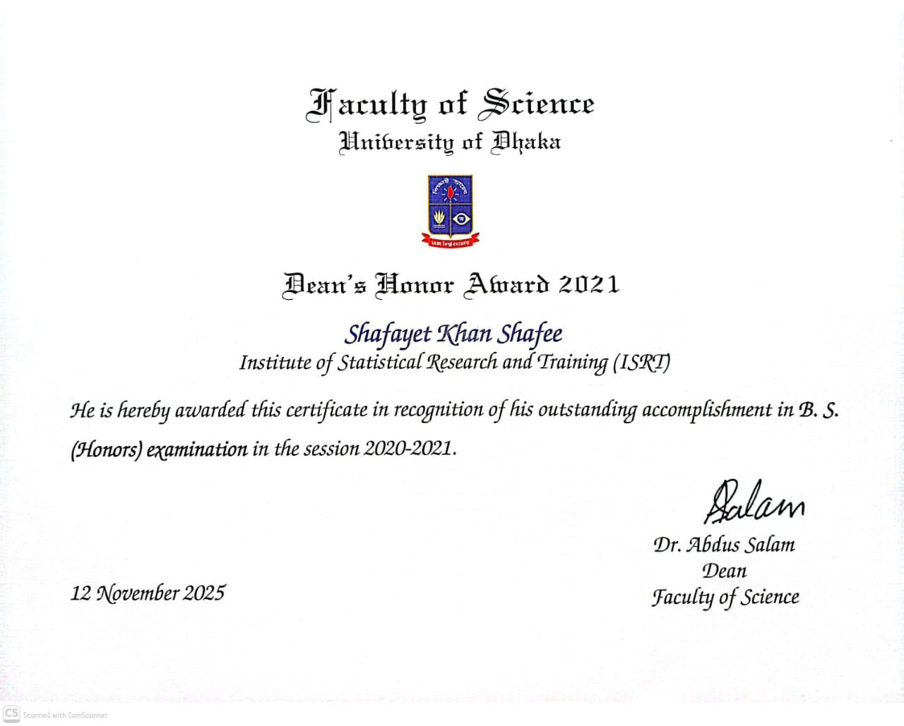

::: {#hero-banner}
:::

:::: {.about-body}

:::: {.quote-intro}

> *I'm a **Data Scientist** and **Statistician** with a focus on applying statistical 
thinking to real product and business decisions. My interests and expertise lie 
at the intersection of applied statistics, machine learning, and open-source 
development &mdash; turning rigorous analytical ideas into practical tools, 
software, and workflows. ^[All em-dashes are mine!]*

:::

##  What I Do

In my day job, I work as a data scientist, where I spend most of my time building 
data pipelines and models, designing and analyzing experiments, and applying 
causal inference and machine learning methods to product and business problems 
&mdash; things like measuring the impact of product rollouts, estimating 
heterogeneous treatment effects, and modeling repayment risk.

Outside of work, I read and explore a fair bit &mdash; mostly around causal 
inference (IPW, confounding bias, meta-learners, double machine learning, causal 
forests), Bayesian inference, survival analysis, and lately sensitivity analysis 
in causal inference. Some of that eventually turns into research; the rest just 
feeds my curiosity.

I'm also quite enthusiastic about open-source development. I've built a few
&nbsp;packages, 
&nbsp;packages,
and Quarto extensions, and I'm always looking for ways to improve the tools I 
rely on. **R** is my first love ,
but I also work comfortably with **Python** & **SQL** . 
Along the way I also picked up a bit of **Lua** while building 
[*Quarto extensions*](https://quarto.org/docs/extensions/), and I have a 
long-standing curiosity about systems languages like **Rust** and high-performance 
scientific computing languages like **Julia** .

##  Research & Publications

My published work so far centres on **causal inference** and **hierarchical modeling**, 
with a focus on developing and applying rigorous statistical methods to complex 
observational data from public health settings.

:::: {.highlight}

I have one peer-reviewed publication in *PLoS ONE* (a Q1 journal) on estimating 
the causal effect of maternal continuum of care on child nutrition in Bangladesh 
using multilevel propensity score methods.

:::

Two additional works are currently under review &mdash; one on g-computation for 
causal effect estimation in hierarchical observational data, and one on estimation 
of the median odds ratio for measuring contextual effects in multilevel binary 
data &mdash; preprints of both are available on arXiv. [See full list of publications &rarr;](publications/index.qmd)

::: {.interests}

#### Research Interests

- Causal Inference
- Hierarchical Modeling
- Bayesian Inference
- Sensitivity Analysis
- Survival Analysis
- Conformal Prediction
:::

##  Work Experience 

- **Data Scientist II** @ [Pathao Pay](https://pathaopay.com/?lang=en)  
  *Jan, 2026 - Present*  
  Dhaka, Bangladesh

- **Data Scientist I** @ [Pathao Pay](https://pathaopay.com/?lang=en)  
  *Jan, 2025 - Dec, 2025*  
  Dhaka, Bangladesh

- **Graduate Data Scientist** @ [Pathao Ltd.](https://pathao.com/?lang=en)  
  *July, 2023 - Dec, 2024*  
  Dhaka, Bangladesh
  

##  Technical Skills

- **Statistics & Experimentation:** Frequentist & Bayesian Inference, Hypothesis 
  Testing, Causal Inference (IPW, Matching, Diff-in-Diff), A/B Testing, Survival 
  Modeling, Time Series Analysis.
- **Machine Learning:** Ensemble Methods, Causal ML (Double/Debiased ML, 
  Generalized Random Forests, BART), Conformal Prediction, Model Calibration.
- **Data & ML Engineering:** dbt, Kedro, MLflow, Docker, Bash Scripting.
- **BI & Analytics:** BigQuery, Looker Studio, Mixpanel.
- **CI/CD & Version Control:** GitHub Actions, GitLab CI, Git.
- **Programming Languages:** R, Python, SQL.

##  Open Source Contributions

My OSS work spans R, Python, and the [Quarto](https://quarto.org/) ecosystem. On the R side,
I've developed [MOR](https://shafayetshafee.github.io/MOR/) and
[skmisc](https://shafayetshafee.github.io/skmisc/), and on the Python side,
[skmiscpy](https://skmiscpy.readthedocs.io/en/latest/) for causal effect estimation and
[kedrogen](https://github.com/shafayetShafee/kedrogen), a CLI tool for scaffolding
reproducible Kedro project structures. I've also built a range of Quarto extensions
(e.g., [downloadthis](https://github.com/shafayetShafee/downloadthis),
[line-highlight](https://github.com/shafayetShafee/line-highlight), and
[interactive-sql](https://github.com/shafayetShafee/interactive-sql)) to support
more efficient scientific publishing workflows.

##  Education {.education}

- [2023]{.year} **_M.Sc._ in Applied Statistics**\
  Grade: _**3.97** out of 4.00_  
  [*ISRT, University of Dhaka, Bangladesh*]{.institution}   
  
  **Selected Coursework:**
  Causal Inference, Multilevel Modeling, Bayesian Inference, 
  Statistical Machine Learning, Spatial Statistics, Signal Processing.
  
  **Tools:** R, Python, SQL.

- [2021]{.year} **_B.Sc._ in Applied Statistics**\
  Grade: _**3.96** out of 4.00_  
  [*ISRT, University of Dhaka, Bangladesh*]{.institution}   
  
  **Selected Coursework:**
  Calculus, Linear Algebra, Sampling Distributions, Sampling Methods, 
  Statistical Inference, Stochastic Processes, Design and Analysis of Experiments,
  Industrial Statistics and Operations Research, Mathematical Analysis,
  Multivariate Statistics, Linear Regression Analysis, Generalized Linear Models, 
  Epidemiology, Survival Analysis, Analysis of Time Series, Bayesian Inference,
  Econometrics.
  
  **Tools:** C, Excel, Octave, SPSS, Stata, Minitab, R.
  
- [2017]{.year} **_H.S.C._ (Science)**\
  Grade: _**5.00** out of 5.00_

  
##  Honors & Awards

- **Dean's Award**, Faculty of Science, University of Dhaka, **2021**  
  Awarded in recognition of academic excellence.  
  {.lightbox width="120px"}

- **Conference Award for Scientists**, ISCB45, **2024**  
  Awarded at the 45th Annual Conference of the 
  [International Society for Clinical Biostatistics](https://iscb.international/) 
  (ISCB45), Thessaloniki, Greece, July 21–25, 2024, for the abstract titled *"Interval Estimation 
  of the Median Odds Ratio for Measuring Contextual Effects in Multilevel Data Using a Binary 
  Logistic Model."*  [[Abstract Book]](https://convin.gr/assets/files/misc/ISCB2024Program_AbstractBook.pdf){target="_blank"}

- **National Science and Technology (NST) Fellowship**, **Oct 2023**  
  Issued by the Ministry of Science and Technology, Government of Bangladesh, for thesis research 
  on multilevel modeling during M.Sc. at the University of Dhaka.

##  Work Interests {.interests}

- Causal Inference
- Experimentation
- Hierarchical Modeling
- Bayesian Inference
- Predictive Modeling
- Time Series Forecasting
- Reproducible Research
- Open Source Contributions
- R & Python Pkg Development
- Data Visualisation & Storytelling

:::